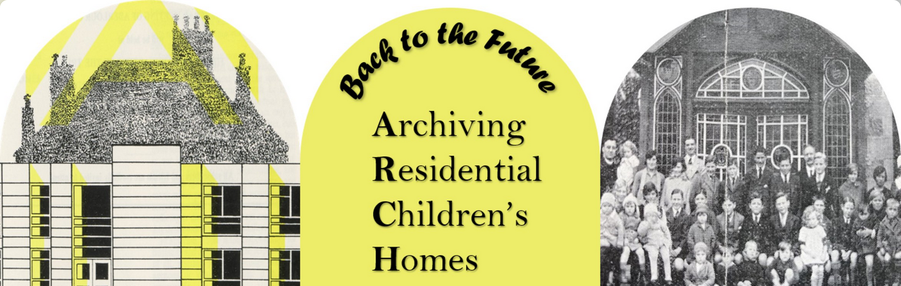

# ARCH: Digital Community Archives for Residential Care Groups

This repository contains a Django implementation of a digital community archive for Residential Care Groups. 
The web-application was developed as part of the study **Back to the Future – Archiving Residential Children’s Homes 
(ARCH) in Scotland and Germany**. 
The software is available under a free and open-source [Licence](LICENSE). 

## Table of Contents

- [The ARCH study](#the-arch-study)
- [The Software](#the-software)
- [Installation and Deployment](#installation-and-deployment)
- [Development](#development)

## The ARCH study

The study **Back to the Future: Archiving Residential Children’s Homes (ARCH) in Scotland and Germany** is a co-operative 
research project between the University of Stirling and the University of Osnabrück. The project aims to advance current 
understandings of the role that new technologies play in state-individual interactions and the extent to which such 
technologies offer a virtual space for remembering together and capturing everyday and group experiences in residential 
care. In collaboration with children and young people in care,  care leavers, and staff in 2 residential children's homes 
(one in Scotland and one Germany), the research team developed 'living digital archives'. 

Participants were asked to consider what should be stored, by and for whom, as well as thinking through the ethical 
and moral dimensions of collective archives. Through this participatory software development, a platform 
for storing, sharing, and curating multimedia files was designed. This repository provides a prototypical implementation 
of a web-application for such 'living' archives in the context of residential care groups. 

For more information on the ARCH study, see the following link:
- https://archproject.stir.ac.uk/
- https://www.paedagogik.uni-osnabrueck.de/abteilungen/allgemeine_erziehungswissenschaft_sozialpaedagogik_und_fruehe_bildung/erziehungswissenschaft_mit_sozialpaedagogischem_forschungsschwerpunkt_florian_esser/forschungsprojekte_research_projects/arch.html

## The Software

This repository contains the source code for the digital community archive developed as part of the ARCH project. 
An overview over the features of the application is presented in the following list:

- [x] User Authentication and Authorization
- [x] User Management and Group Memberships
- [x] Fine-grained Access Control
- [x] Multimedia Support (Images, Videos, Audio, Documents)
- [x] Content Management and Moderation
- [x] Album and Media Management
- [x] Multi-Language Support
- [x] Automated Metadata Extraction
- [x] AI-powered Search and Filter Functionality
- [x] Face Detection and Person Tagging
- [x] Comments
- [x] GDPR Compliance and Control over Personal Data

## Installation and Deployment

See [here](docs/Deployment.md) for a guide on how to install and deploy the application. 

## Development

Useful resources for development are listed below:

- [Commands](docs/Commands.md)
- [Automatic Tests](docs/Automatic_Tests.md)
- [Data Model Graph](assets/data_model_all.png)

## Credits

The development of the ARCH software was funded by the German Research Foundation (DFG) and the Arts and Humanities 
Research Council (AHRC). The study was led by Prof. Dr. Florian Esser (Universität Osnabrück) and Prof. Dr. Ruth Emonds 
(University of Stirling). The software was developed by Dr. Tobias Thelen, Malte Heyen and Yesid Cano Castro.
